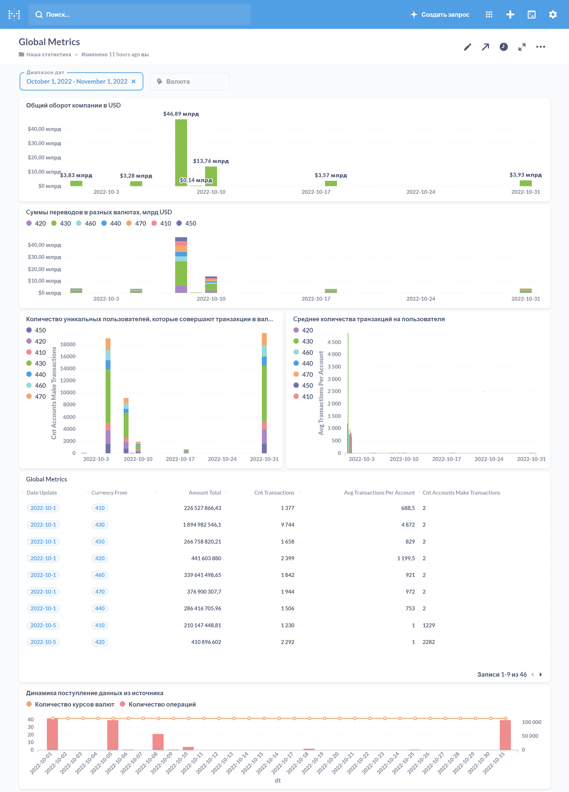

# Итоговый проект

## Описание
Репозиторий итогового проекта курса Data Engineer.

### Структура репозитория
Файлы в репозитории будут использоваться для проверки и обратной связи по проекту. Поэтому постарайтесь публиковать ваше решение согласно установленной структуре: так будет проще соотнести задания с решениями.

Внутри `src` расположены папки:
- `/src/dags` - каталог хранения DAG монтируемый при старте контейнера. 
	* `1_data_import.py` - пайплайн наполнения STG из реплики продуктового Postgres данными таблиц `currencies` и `transactions`. 
	* `2_datamart_update.py`- пайплайн обновлющий витрину данных `global_metrics` 
- `/src/sql` - DDL для `STG`- и `CDM`-слоев.
- `/src/img` - скриншот реализованного над витриной дашборда `Global Metrics`.
- `/src/py` - не используется в текущей реализации.


## Архитектура
Выбраная архитектура решения


## Запуск инфраструктуры 
### Локальная
```bash
docker compose -f "docker-compose.yaml" up -d --build
```
Информация по размещению инструментов есть внутри образа, в частности:
- Адрес Metabase — 8998. http://localhost:8998/
- Адрес Airflow — 8280.  http://localhost:8280/airflow/ 
- Postgres - 15432. 

### Облачная

Установите **виртуальную машину с помощью Telegram-бота. ВМ будет генерировать сообщения в Kafka, чтобы создать подключение по SSH. IP-адрес для ВМ бот выдаст. 
При запуске инфраструктуры в веб-интерфейсах, требующих авторизации, вам будет предоставлен логин и пароль. Если вы удаляете инфраструктуру, то всё содержимое тоже удаляется: не забудьте сохранить свои наработки локально.


### Extract data from
В компании запущена PostgreSQL для продакшена. Для построения инфраструктуры аналитики и поставки данных предоставлена отдельная PostgreSQL, копия продовой БД. В таблицах public.transactions и public.currencies есть доступ на загрузку данных.
```json
{
	"database": "db1",
	"host" : "rc1b-w5d285tmxa8jimyn.mdb.yandexcloud.net",
	"port" : "6432",
	"username" : "[secrets]",
	"password" : "[secrets]"
}
```
Креды: [secrets](./secrets/secrets.md)
Перед тем как подключиться к БД, скачайте [сертификат](https://storage.yandexcloud.net/cloud-certs/CA.pem).

### Load data to
Vertica
Адрес сервера:  vertica.tgcloudenv.ru / "51.250.75.20"
``` json
{
	"host":"51.250.75.20",
	"port":"5433",
	"user":"[secrets]",
	"password":"[secrets]",
	"database":"dwh",
	"autocommit":"True"
}
```
Креды: [secrets](./secrets/secrets.md)
## Data

### transactions
Данные `transactions` содержат в себе информацию о движении денежных средств между клиентами в разных валютах.

Структура данных:
- `operation_id` — id транзакции;
- `account_number_from` — внутренний бухгалтерский номер счёта транзакции ОТ КОГО; 
- `account_number_to` — внутренний бухгалтерский номер счёта транзакции К КОМУ;
- `currency_code` — трёхзначный код валюты страны, из которой идёт транзакция;
- `country` — страна-источник транзакции;
- `status` — статус проведения транзакции: 
	* `queued` («транзакция в очереди на обработку сервисом»), 
	* `in_progress` («транзакция в обработке»), 
	* `blocked` («транзакция заблокирована сервисом»), 
	* `done` («транзакция выполнена успешно»), 
	* `chargeback` («пользователь осуществил возврат по транзакции»).
- `transaction_type` — тип транзакции во внутреннем учёте: 
	* `authorisation` («авторизационная транзакция, подтверждающая наличие счёта пользователя»), 
	* `sbp_incoming` («входящий перевод по системе быстрых платежей»), 
	* `sbp_outgoing` («исходящий перевод по системе быстрых платежей»), 
	* `transfer_incoming` («входящий перевод по счёту»), 
	* `transfer_outgoing` («исходящий перевод по счёту»), 
	* `c2b_partner_incoming` («перевод от юридического лица»), 
	* `c2b_partner_outgoing` («перевод юридическому лицу»).
- `amount` — целочисленная сумма транзакции в минимальной единице валюты страны (копейка, цент, куруш); 
- `transaction_dt` — дата и время исполнения транзакции до миллисекунд.

Заметки о данных:
1. `account_number_from` бывает `-1`, но `account_number_to` - нет. Возможно `-1` это первичное зачисление средств.
1. `amount` может быть отрицательным. при любом значении `status` (не только `chargeback`). Как это интерпретировать? 
1. одна операция встречается много раз с разными статусами. Выбирать надо только t.status = 'done', 
1. нужно вычесть из выборки те operation_id по которым есть status = 'chargeback' т.к. такие транзакции выглядят как отмененные. Справка: `A chargeback is a transaction where funds are transferred by an issuing bank from the merchant's account to the customer's account. A chargeback is initiated when a customer escalates a dispute against the merchant.`
1. операции есть `transaction_type like '%incoming'` с положительным amount и `transaction_type like '%outgoing'` с отрицательным amount. Если сложить их как есть мы получим ерунду, т.к. у нас есть если  клиент А перевел 100 руб клиенту Б то сумма по двум транакциям будет 0. Но я не совсем понимаю должна ли "общая сумма транзакций"  быть 100р (выбираем только один тип, например incoming" или 200р (т.е. суммируем по модулю).

!!! От постановщика задачи (куратор, преподаватель) не получены комментарии по найденным вопросам, задаем указанными выше предположениями.

### сurrencies
Данные `сurrencies` — это справочник, который содержит в себе информацию об обновлениях курсов валют и взаимоотношениях валютных пар друг с другом.

Структура данных:
- `date_update` — дата обновления курса валют;
- `currency_code` — трёхзначный код валюты транзакции;
- `currency_code_with` — отношение другой валюты к валюте трёхзначного кода;
- `currency_code_div` — значение отношения единицы одной валюты к единице валюты транзакции.

### global_metrics
Целевая витрина `TIM_ALEINIKOV_YANDEX_RU__DWH.global_metrics`
- `date_update` — дата расчёта,
- `currency_from` — код валюты транзакции;
- `amount_total` — общая сумма транзакций по валюте в долларах;
- `cnt_transactions` — общий объём транзакций по валюте;
- `avg_transactions_per_account` — средний объём транзакций с аккаунта;
- `cnt_accounts_make_transactions` — количество уникальных аккаунтов с совершёнными транзакциями по валюте.

# Dashboard

